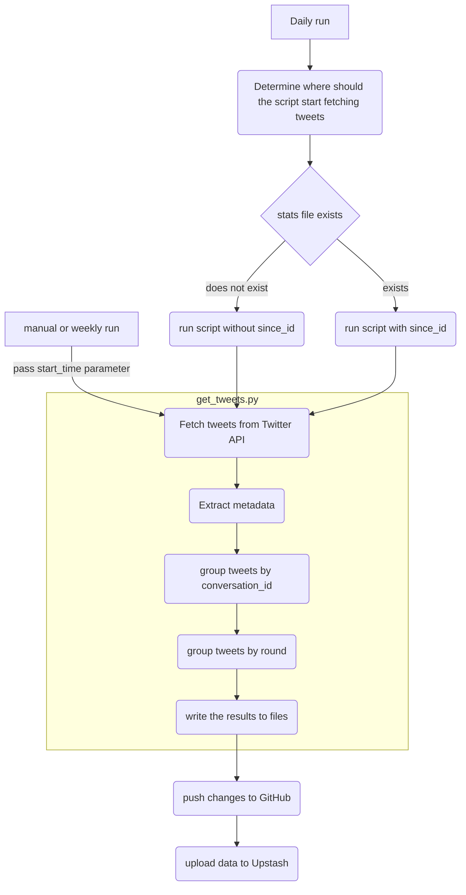

# hdoc-tracker [25/54]

## TODO

- [x] GitHub actions
- [x] Streak count (longest and current)
- [x] extract more entities (link to src, demo, etc.)
- [x] list view
  - [x] timestamp
  - [x] extra entities (demo, src, etc.)
  - [x] Link to original tweet
- [x] thread view
  - [x] YouTube reply clone
- [x] Keyboard shortcuts dialog + ? binding to display it
- [x] improve color contrast (thanks to VisBug)
- [ ] pytest
  - [x] at least have some tests
  - [ ] 80% coverage
  - [x] coverage
  - [ ] GitHub Actions
- [ ] jest unit tests
  - [x] at least have some tests
  - [ ] 80% coverage
  - [ ] GitHub Actions
- [ ] cypress
- [x] routing
- [ ] refactor UI code
- [ ] refactor backend code
- [x] responsive
- [x] mobile friendly
- [x] Search functionality
- [x] dark mode
- [-] adaptive SVG favicon
- [x] SVG className instead of other state prop
- [ ] performance measurement
  - [ ] get_tweets time taken (incremental fetch already?)
  - [ ] Lighthouse Mobile score
  - [ ] Lighthouse Desktop score
- [ ] performance improvements
- [ ] about page with Mermaid https://www.youtube.com/watch?v=6TiIrJf63Xs
- [ ] support for new rounds (backend)
  - [x] folder-based? nope
  - [x] Filter by round
  - [x] need an API for new rounds (or for the sake of learning 😏)
- [ ] support for new rounds (UI)
- [ ] put more context in automatic commits
  - [ ] time taken
  - [ ] pretty stats table (probably better add a comment in each automatic tweet)
- [ ] new data storage design
  - [ ] where to keep the backend state (everything in upstash?)
  - [ ] data backup (S3 or some storage service)
- [ ] more entity support
  - [ ] npm
  - [ ] pypi
  - [ ] rust package
  - [ ] go package

## bugs

- [x] time zone bug in `formatTwitterDate` function
- [x] no streaks, but display the most recent streak instead
- [ ] compare_tweets bug (counting number of tweets has some issues, e.g., what about replies tweets)

## useful resources

- mocking Date in jest
  - https://github.com/facebook/jest/issues/2234#issuecomment-731451275
- crop PNG
  - https://www.iloveimg.com/crop-image/crop-png
- PyGithub update multiple files
  - https://github.com/PyGithub/PyGithub/issues/1628#issuecomment-671173979

## layout resource, inspirations

- grid layout with side navigation rails
  - https://developer.chrome.com/

## design

### data to keep in stats file (sample)

| field                  | data                                |
| ---------------------- | ----------------------------------- |
| since_id               | 1234567 (loaded from metadata file) |
| total tweets count     | 300                                 |
| tweets count (round 1) | 120                                 |
| tweets count (round 2) | 180                                 |
| elapsed time (seconds) | 3.33                                |

### flowchart for data fetching/processing pipeline

